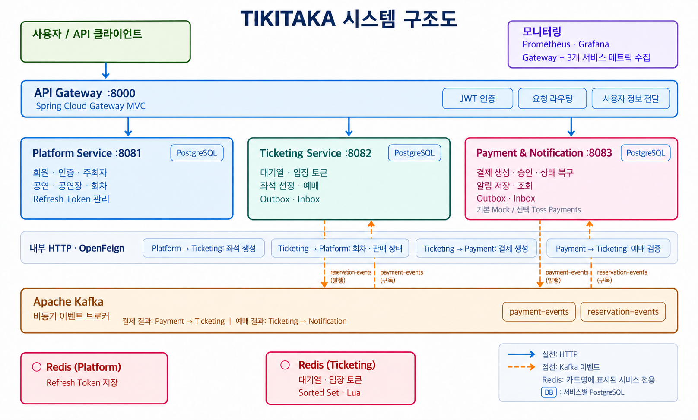
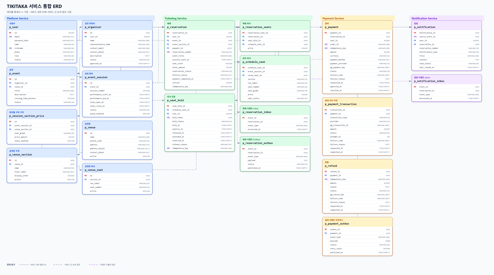
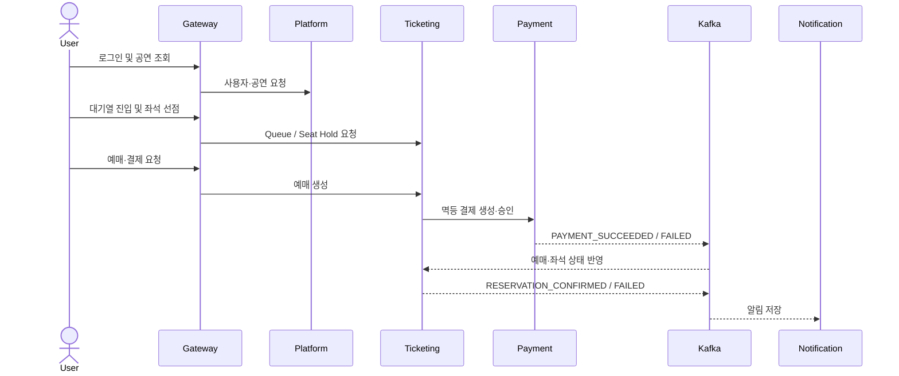

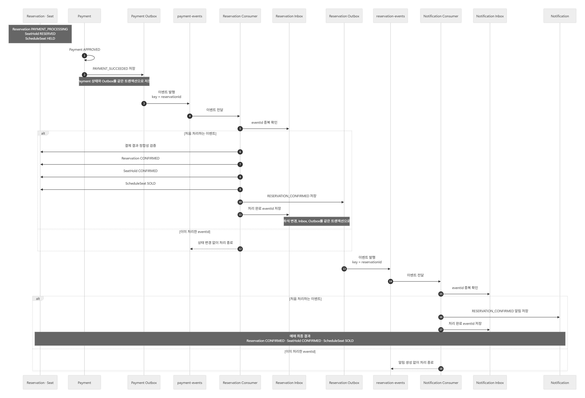
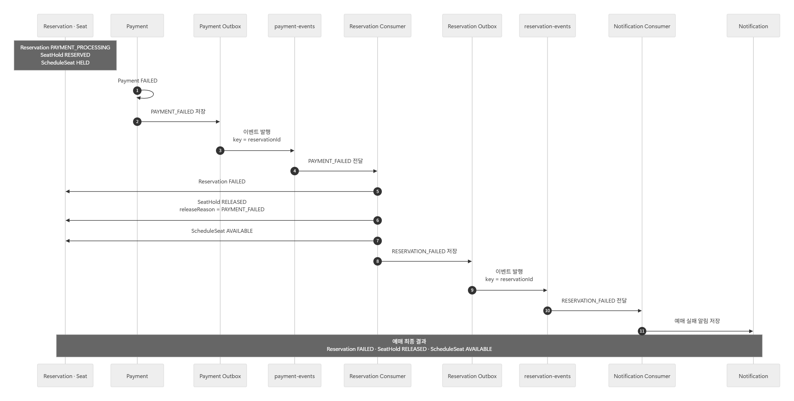
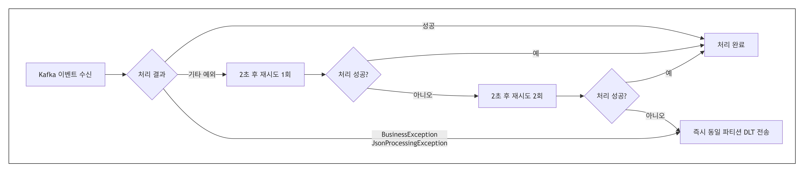
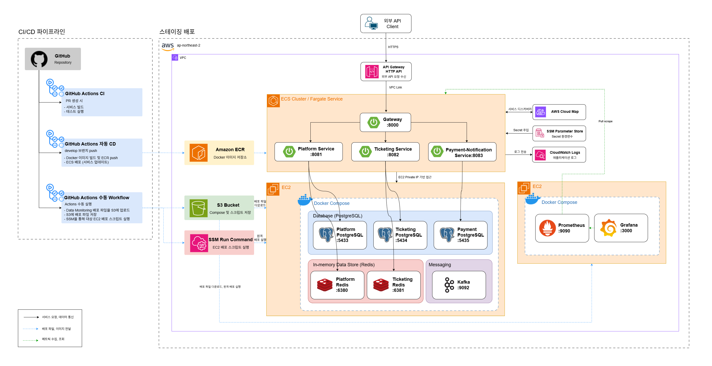

# TIKITAKA

공연 탐색부터 대기열, 좌석 선점, 예매, 결제, 알림까지 하나의 흐름으로 연결한 MSA 기반 공연 예매 플랫폼입니다.

티켓 오픈 시점의 집중 트래픽과 동일 좌석에 대한 동시 요청을 안정적으로 처리하고, 결제와 예매 사이의 데이터 정합성을 유지하는 데 초점을 맞췄습니다.

## 프로젝트 목표

공연 예매는 판매 오픈 순간 요청이 집중되고, 여러 사용자가 같은 좌석을 선택하며, 결제 결과가 비동기로 반영되는 특성이 있습니다. TIKITAKA는 이 흐름을 서비스 책임에 따라 분리하고 다음 문제를 해결합니다.

- 대기열로 순간적인 진입 요청을 제어합니다.
- 하나의 좌석은 한 사용자만 선점하도록 동시성을 제어합니다.
- 재시도와 응답 유실에도 예매와 결제가 중복 생성되지 않도록 합니다.
- 결제·예매·좌석 상태를 일관되게 확정하거나 복구합니다.
- 알림 장애가 예매 성공에 영향을 주지 않도록 후속 처리를 비동기로 분리합니다.

## 주요 기능

| 영역 | 제공 기능 |
| --- | --- |
| 인증·사용자 | 회원가입, 로그인, 토큰 재발급·로그아웃, 프로필 관리, JWT 인증·인가 |
| 공연 운영 | 주최자·공연장·공연·회차 관리, 좌석 등급·가격 설정, 공연 공개와 검색 |
| 대기열 | Redis ZSET 기반 순번 관리, Admission Token 발급, Heartbeat와 비활성 사용자 정리 |
| 좌석 | 회차별 좌석 조회, 제한 시간 선점, 만료·결제 실패 시 좌석 반환 |
| 예매 | 멱등 예매 생성, 사용자별 예매 조회, 결제 결과에 따른 확정·실패 처리 |
| 결제 | Mock/Toss PG 연동, 중복 승인 방지, UNKNOWN 상태 조회와 스케줄러 기반 복구 |
| 알림 | 예매 결과 이벤트 소비, 알림 저장·조회·읽음 처리, 실패 이벤트 DLT 격리 |
| 관측 | 요청별 Trace ID, Actuator 메트릭, Prometheus·Grafana 대시보드, Loki 로그 |

## 시스템 구성

| 모듈 | 책임 | 포트 |
| --- | --- | ---: |
| Gateway | 외부 API 단일 진입점, JWT 검증, 라우팅, Trace ID 발급 | 8000 |
| Platform Service | 사용자·인증, 주최자, 공연장, 공연·회차 관리 | 8081 |
| Ticketing Service | 대기열, 좌석 재고·선점, 예매 관리 | 8082 |
| Payment & Notification Service | 결제 승인·복구, 예매 결과 알림 | 8083 |

각 서비스는 자신의 PostgreSQL을 독립적으로 소유하며 다른 서비스의 데이터베이스에 직접 접근하지 않습니다. 즉시 응답이 필요한 조회와 검증에는 REST/OpenFeign을 사용하고, 결제·예매 완료 후속 처리는 Kafka 이벤트로 전달합니다.



### 설계 원칙

- 외부 요청은 Gateway를 단일 진입점으로 사용합니다.
- Gateway는 JWT와 신뢰 헤더를 검증하고, 각 서비스는 리소스 소유권과 도메인 권한을 다시 확인합니다.
- 서비스마다 데이터 저장소를 분리하고 다른 서비스의 DB를 직접 조회하지 않습니다.
- 동기 검증은 REST/OpenFeign, 완료 사실과 후속 처리는 Kafka 이벤트로 전달합니다.
- PostgreSQL을 영속 데이터의 최종 기준으로 사용하며 Redis 상태만으로 판매 완료를 확정하지 않습니다.
- 서비스 사이에 도메인 모델과 비즈니스 규칙을 공유하지 않습니다.

### 데이터 구조

서비스별 데이터 소유권을 분리하고, 다른 서비스의 데이터는 식별자만 참조합니다. 실선은 서비스 내부 물리 FK, 점선은 서비스 간 논리 참조, 보라색 점선은 이벤트 식별자 참조를 나타냅니다.



## 예매 흐름



- 대기열은 `WAITING → ADMITTED → ENTERED` 상태로 입장을 제어합니다.
- 좌석 선점은 만료되거나 결제에 실패하면 판매 가능한 상태로 돌아갑니다.
- 결제 결과는 Outbox를 통해 발행하고, 소비자는 Inbox로 중복 처리를 방지합니다.

## 핵심 기술 설계

### 좌석 선점과 동시성

동일 좌석에 대한 요청은 PostgreSQL 비관적 락으로 직렬화합니다. 좌석 상태는 `AVAILABLE → HELD → SOLD`로 관리하며, 선점 만료나 결제 실패 시 `AVAILABLE`로 되돌립니다. `Idempotency-Key`와 DB Unique 제약을 함께 적용해 동일 요청의 재전송과 완전 동시 요청에서도 선점이 중복 생성되지 않도록 했습니다.

### 대기열과 입장 제어

회차별 대기 순서는 Redis ZSET, 사용자 상태는 HASH로 관리합니다. Lua Script로 등록과 상태 전이를 원자적으로 처리하고, Scheduler가 정해진 인원만 `WAITING → ADMITTED`로 전환합니다. Admission Token과 Heartbeat를 사용해 입장 권한과 비활성 사용자를 관리합니다.

### 예매·결제 멱등성과 복구

예매 생성은 준비, 외부 Payment 호출, 완료 단계로 나눕니다. Payment 응답이 유실되어도 `PAYMENT_PENDING` 예매를 보존하고, 같은 요청이 재전송되면 기존 Reservation과 Payment를 연결해 처리를 이어갑니다. 결제 승인 경쟁은 `READY → PROCESSING` 조건부 상태 변경으로 한 요청만 처리 권한을 갖도록 합니다. PG 결과를 확정할 수 없으면 `UNKNOWN`으로 보존한 뒤 Reconciliation Scheduler가 실제 결제 상태를 조회합니다.

### 이벤트 정합성과 장애 격리

결제 상태 변경과 Outbox 저장을 같은 DB 트랜잭션으로 처리하고, Kafka 발행은 별도로 재시도합니다. Reservation과 Notification Consumer는 이벤트 ID 기반 Inbox로 중복 처리를 막습니다. 복구 불가능한 오류는 즉시 DLT로 보내고 일시적 오류만 제한적으로 재시도해 실패 이벤트가 후속 메시지 처리를 막지 않도록 했습니다.

<details>
<summary><strong>결제·예매 이벤트 처리 흐름</strong></summary>

Payment의 결제 결과가 Ticketing의 예매·좌석 상태에 반영되고, 최종 예매 결과가 Notification으로 전달되는 전체 흐름입니다.



</details>

<details>
<summary><strong>결제 성공 이벤트 처리 흐름</strong></summary>

`PAYMENT_SUCCEEDED` 이벤트를 기준으로 예매, 좌석 선점, 회차 좌석을 확정하고 성공 알림을 생성합니다.



</details>

<details>
<summary><strong>결제 실패 이벤트 처리 흐름</strong></summary>

`PAYMENT_FAILED` 이벤트를 기준으로 예매를 실패 처리하고, 좌석 선점 해제와 회차 좌석 반환 후 실패 알림을 생성합니다.



</details>

<details>
<summary><strong>Kafka Consumer 재시도 및 DLT 처리 흐름</strong></summary>

일시적 오류는 2초 간격으로 최대 두 번 재시도하고, 복구 불가능한 오류나 최종 실패 이벤트는 동일 파티션의 DLT로 격리합니다.



</details>

## 주요 개선 및 검증

| 문제 | 개선 | 검증 결과 |
| --- | --- | --- |
| 결제 생성 응답 유실 시 Payment만 남고 예매 재시도가 실패 | 예매 의도를 먼저 커밋하고 준비·외부 호출·완료 트랜잭션 분리 | 같은 요청 재전송으로 기존 Reservation과 Payment 연결, 중복·고아 데이터 없이 복구 |
| 좌석 목록 전체 직렬화로 고부하 시 응답 지연과 타임아웃 발생 | 페이지네이션, 필요한 필드만 조회하는 프로젝션, 2초 로컬 캐시 적용 | 1,000 VU에서 평균 2,467ms → 269.8ms, 오류율 30.46% → 0%; p95 1,021.6ms로 목표 500ms는 미달 |
| Kafka Consumer가 모든 오류를 반복 재시도 | 복구 가능 여부에 따른 Retry 정책과 DLT 도입 | 정상 이벤트 1,000건 성공률 100%·Lag 0 유지, 실패 처리 시도 80% 감소, 최종 실패 10건 전부 격리 |
| 동일 결제에 여러 승인 요청이 동시 도착 | PostgreSQL 조건부 UPDATE로 처리 권한 선점 | 한 요청만 승인하고 PaymentTransaction과 Outbox가 각각 한 건만 생성됨 |

측정값은 특정 로컬·스테이징 환경에서 수행한 시나리오 결과이며 운영 환경의 처리량을 보장하지 않습니다. 조건과 한계가 포함된 원문은 [테스트 결과 문서](docs/test-results/README.md)에서 확인할 수 있습니다.

## 기술 스택

| 구분 | 기술 |
| --- | --- |
| Backend | Java 21, Spring Boot 3.5.16, Spring Cloud 2025.0.3, Spring Security, Spring Data JPA, OpenFeign |
| Data | PostgreSQL 16, Redis, Flyway, QueryDSL |
| Messaging | Apache Kafka, Transactional Outbox, Inbox |
| Test | JUnit 5, Testcontainers, Postman, k6 |
| Observability | Spring Boot Actuator, Prometheus, Grafana, Loki |
| Infrastructure | Docker Compose, AWS API Gateway, ECS Fargate, ECR, Cloud Map, SSM Parameter Store, CloudWatch |
| CI/CD | GitHub Actions |

## 인프라 및 배포

애플리케이션은 AWS API Gateway와 VPC Link를 통해 ECS Fargate의 Gateway로 진입합니다. 네 애플리케이션은 독립된 ECS Service로 배포하며, PostgreSQL·Redis·Kafka는 데이터용 EC2에서 Docker Compose로 운영합니다. GitHub Actions와 OIDC를 이용해 이미지를 ECR에 게시하고 ECS를 배포하며, 환경변수와 비밀정보는 SSM Parameter Store에서 주입합니다.



## 프로젝트 구조

```text
tikitaka/
├─ gateway/                         # 인증, 라우팅, 요청 추적
├─ platform-service/                # 사용자, 주최자, 공연·공연장
├─ ticketing-service/               # 대기열, 좌석, 선점, 예매
├─ payment-notification-service/    # 결제와 알림
├─ scripts/                         # 통합·부하 테스트 시나리오
├─ docs/                            # 개발, API, CI/CD, 테스트 문서
├─ docker-compose.yml               # 로컬 전체 환경
├─ docker-compose.test.yml          # 시나리오 테스트 환경
└─ build.gradle                     # 공통 Gradle 설정
```

## 로컬 실행

### 준비 사항

- Git
- JDK 21
- Docker Desktop 또는 Docker Engine + Compose

### 실행 방법

```bash
git clone https://github.com/tikitaka-team-8/tikitaka.git
cd tikitaka
git switch develop
```

저장소 루트의 `.env.example`을 참고해 팀에서 공유한 개발용 값을 `.env`에 설정합니다. `.env`와 실제 인증 정보는 Git에 커밋하지 않습니다.

```bash
docker compose config --quiet
docker compose up -d --build --wait
docker compose ps
```

모든 외부 API 요청은 Gateway의 `http://localhost:8000`을 통해 접근합니다. 서비스별로 IDE에서 실행하거나 필요한 인프라만 시작하는 방법은 [개발 실행 가이드](docs/development/development-workflows.md)를 참고해 주세요.

종료할 때는 다음 명령을 사용합니다.

```bash
docker compose down
```

## 테스트

일반 테스트와 외부 인프라를 사용하는 통합 테스트를 분리해 실행합니다. 통합 테스트에는 Docker가 필요합니다.

```bash
./gradlew test
./gradlew integrationTest
./gradlew build
```

Windows PowerShell이나 명령 프롬프트에서는 `./gradlew` 대신 `gradlew.bat`을 사용합니다.

## Contributors

| 팀원 | GitHub | 주요 담당 |
| --- | --- | --- |
| 이초인 | [@cccd3](https://github.com/cccd3) | 개발 리드, 공통 기반·인증·Gateway, 인프라와 CI/CD |
| 강현모 | [@kanghm199](https://github.com/kanghm199) | 주최자·공연·공연장·회차 도메인 |
| 손유진 | [@kryptonite43](https://github.com/kryptonite43) | 예매·알림 도메인과 Kafka 이벤트 처리 |
| 주원영 | [@dnjsdud0702](https://github.com/dnjsdud0702) | 좌석·좌석 선점과 동시성 제어 |
| 김서인 | [@SiruDuck](https://github.com/SiruDuck) | 결제·PG 연동과 결제 상태 복구 |
| 송채영 | [@buddle031](https://github.com/buddle031) | Redis 대기열·입장 제어와 부하 검증 |

## 문서

- [개발 환경 설정](docs/development/development-environment-setup.md)
- [개발 실행 가이드](docs/development/development-workflows.md)
- [통합 테스트 가이드](docs/development/integration-test-guide.md)
- [API 명세](docs/api-specification.md)
- [CI](docs/CI.md) / [CD](docs/CD.md)
- [테스트 결과](docs/test-results/README.md)
